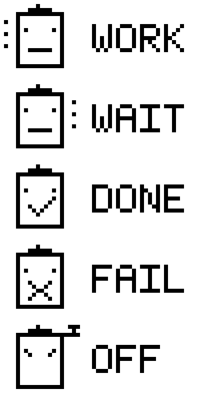

# zmk-tom-oled

`zmk-tom-oled`は、128×32の横向きOLEDに対応したZMKディスプレイシールドです。

`central`側には、次の情報を表示します。

- USB/Bluetoothの接続状態
- WPM連動のBongo Cat、またはCodexのタスク状態
- 有効な修飾キー
- 使用中のレイヤー
- `central`および`peripheral`のバッテリー残量

`peripheral`側には、端末上で取得できる範囲の情報を表示します。

- `central`との接続状態（`CONN OK` / `CONN --`）
- キー入力
- トラックボール操作のアニメーション
- 切断時のアニメーション

## Usage

`config/west.yml`にこのモジュールを追加し、`west update`を実行します。

```yaml
manifest:
  remotes:
    - name: zmkfirmware
      url-base: https://github.com/zmkfirmware
    - name: pukuhei
      url-base: https://github.com/pukuhei
  projects:
    - name: zmk
      remote: zmkfirmware
      revision: main
      import: app/west.yml
    - name: zmk-tom-oled
      remote: pukuhei
      revision: main
  self:
    path: config
```

左右それぞれのビルドターゲットへ、`tom_oled`シールドを追加します。

```yaml
---
include:
  - board: seeeduino_xiao_ble
    shield: your_keyboard_left tom_oled
  - board: seeeduino_xiao_ble
    shield: your_keyboard_right tom_oled
```

OLEDを180度回転して取り付ける場合は、`tom_oled`の後ろへ
`tom_oled_180`を追加します。SSD1306のハードウェア反転を使用するため、文字や
アニメーションを含む画面全体が回転します。

```yaml
---
include:
  - board: seeeduino_xiao_ble
    shield: your_keyboard_left tom_oled tom_oled_180
  - board: seeeduino_xiao_ble
    shield: your_keyboard_right tom_oled tom_oled_180
```

通常の向きへ戻す場合は、シールド一覧から`tom_oled_180`を外してください。

## Configuration

`peripheral`に加えて、`central`側のバッテリー残量も表示します。

```conf
CONFIG_ZMK_TOM_OLED_DONGLE_BATTERY=y
```

修飾キーをmacOSの記号で表示します。

```conf
CONFIG_ZMK_TOM_OLED_MAC_MODIFIERS=y
```

### Codex status

Bongo Catの領域を、Codexのタスク状態（`WORK` / `WAIT` / `DONE` / `FAIL` /
`OFF`）へ切り替えます。この機能は初期状態では無効です。

```conf
CONFIG_ZMK_STUDIO=y
CONFIG_ZMK_TOM_OLED_CODEX_STATUS=y
```

状態は、ZMK Studioの暗号化されたBLE characteristicを通じて受信します。一定時間
更新がなければ自動的に`OFF`へ戻るため、Macのスリープ後も古い状態が残りません。

#### macOS app

Codexデスクトップアプリから監視対象を選び、状態をBluetooth経由でキーボードへ
送信するmacOSメニューバーアプリを同梱しています。Python bridgeの導入やアプリの
ビルドは不要です。

- [Codex OLED 0.1.2 for macOS（Apple Silicon）](apps/Codex-OLED-0.1.2-macOS-arm64.zip)

1. ZIPを展開し、`Codex OLED.app`を「アプリケーション」フォルダへ移動します。
2. 初回起動時はControlキーを押しながらアプリをクリックし、「開く」を選択します。
3. macOSから確認されたら、Bluetoothの使用を許可します。
4. メニューバーからCodex OLEDを開き、監視するタスクとキーボードを選択します。

対応環境はmacOS 14以降を搭載したApple Silicon Macです。キーボードには、
`CONFIG_ZMK_TOM_OLED_CODEX_STATUS=y`を有効にしたファームウェアが必要です。

#### ステータスの種類



| 表示 | 状態 |
| --- | --- |
| `WORK` | Codexがタスクを処理中 |
| `WAIT` | ユーザーの入力または承認待ち |
| `DONE` | タスクが完了 |
| `FAIL` | タスクが失敗または中断 |
| `OFF` | 監視対象なし、または状態の有効期限切れ |

## Notes

このモジュールは`zmk-dongle-display`をベースとしており、`central`側のステータス
画面も近い構成を維持しています。一方、`peripheral`側ではZMKのendpoint、layer、
split batteryなどの情報を同じ方法で取得できません。そのため、接続状態、キー入力、
トラックボール入力など、`peripheral`上で取得できる情報に絞った専用ウィジェットを
使用しています。

## References

`central`側の表示は、Maximilian Englさんの
[`zmk-dongle-display`](https://github.com/englmaxi/zmk-dongle-display)
を参考にしています。
